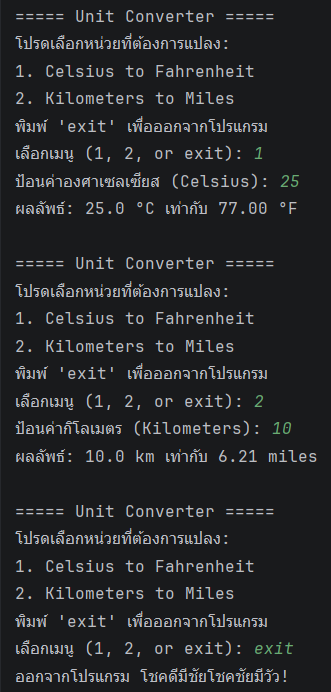

# AI Log - Workshop 1

## Output Console

## รายการที่ 1

| หัวข้อ | คำตอบ                                                                                                                                               |
| --- |-----------------------------------------------------------------------------------------------------------------------------------------------------|
| Prompt ที่ใช้ (สรุป) | ช่วยอธิบายให้หน่อยได้ไหม ว่าต้องทำอะไรบ้างในไฟล์ Workshop1.kt                                                                                       |
| AI ตอบผิด / น่าสงสัยตรงไหน | AI อธิบายภาพรวมได้ถูก แต่ยังไม่ได้ตรวจว่า Code ของเราทำงานได้จริงหรือไม่ และข้อความภาษาไทยในไฟล์แสดงผลเพี้ยนจาก encoding ทำให้อ่าน comment ไม่ชัด   |
| เราตัดสินใจ / แก้อย่างไร | อ่านโครงสร้าง Code เองร่วมกับคำอธิบายของ AI แล้วแยกงานออกเป็นส่วนๆ คือ menu, `when`, ฟังก์ชันคำนวณ, การรับ input และการจัดการ input ที่ไม่ใช่ตัวเลข |
| สิ่งที่ได้เรียนรู้ | ได้เข้าใจ flow ของโปรแกรม console ว่า `main()` ใช้ควบคุมเมนู ส่วนฟังก์ชันย่อยควรแยกหน้าที่ เช่น ฟังก์ชันคำนวณไม่ควรรับ input เอง                    |

## รายการที่ 2

| หัวข้อ | คำตอบ                                                                                                                                                                                                           |
| --- |-----------------------------------------------------------------------------------------------------------------------------------------------------------------------------------------------------------------|
| Prompt ที่ใช้ (สรุป) | ให้ AI review Code Kotlin ที่เขียนเองว่า idiomatic ไหม โดยเฉพาะ `?.`, `?:`, `let`, และ `val`/`var`                                                                                                              |
| AI ตอบผิด / น่าสงสัยตรงไหน | AI ไม่ได้เขียน Code ใหม่ทั้งก้อน แต่บางคำแนะนำเป็นเรื่อง style มากกว่า error เช่น indentation, expression body, และช่องว่างใน `println` จึงต้องแยกว่าอะไรจำเป็นต้องแก้จริงๆ กับอะไรเป็นแค่การเขียนให้สวยขึ้น    |
| เราตัดสินใจ / แก้อย่างไร | เลือกแก้หรือจำจุดที่สำคัญก่อน เช่น ใช้ `val` แทน `var` เมื่อค่าไม่เปลี่ยน, ใช้ `toDoubleOrNull() ?: return` เพื่อจัดการ input ผิดพลาด และตรวจ indentation ให้ตรง scope                                          |
| สิ่งที่ได้เรียนรู้ | ได้เรียนรู้ว่า `toDoubleOrNull()` คืนค่าเป็น `Double?` และ Elvis operator `?:` ใช้จัดการกรณีเป็น `null` ได้ดี ส่วน `let` หรือ `?.` ไม่จำเป็นต้องใช้ทุกครั้ง ถ้าโจทย์เหมาะกับ `?: return` มากกว่าก็ใช้แบบนั้นได้ |
