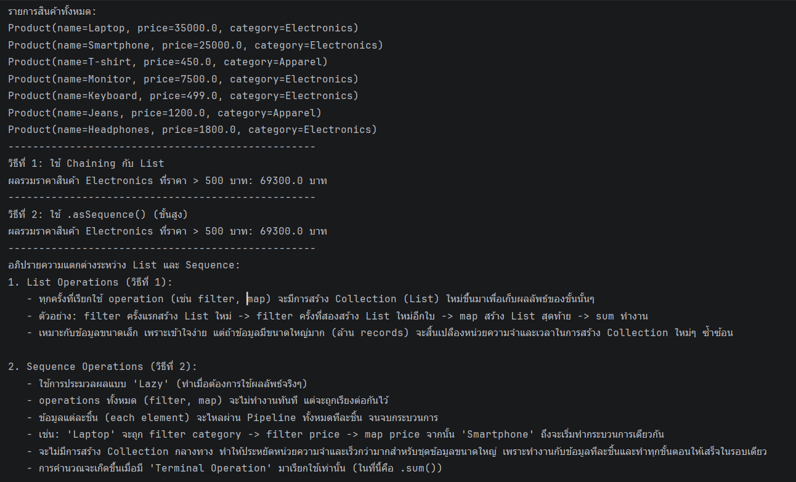

# AI Log - Workshop 2

## Output Console

## รายการที่ 1

| หัวข้อ | คำตอบ |
| --- | --- |
| Prompt ที่ใช้ (สรุป) | ช่วยอธิบายว่าต้องทำอะไรบ้างในไฟล์ `Workshop2.kt` และช่วยตรวจหลังจากทำ Workshop 2 เสร็จแล้ว |
| AI ตอบผิด / น่าสงสัยตรงไหน | AI อธิบายภาพรวมของโจทย์ได้ถูกว่าเป็นการใช้ `data class`, `List`, `filter`, `map`, `sum` และ `asSequence()` แต่ตอนตรวจยังรันผลลัพธ์จริงไม่ได้ เพราะ Gradle มีปัญหากับ Java version ในเครื่อง จึงต้องแยกให้ออกว่าเป็นปัญหา environment ไม่ใช่ปัญหา logic ในไฟล์ |
| เราตัดสินใจ / แก้อย่างไร | ตรวจโค้ดทีละส่วนเอง โดยดูว่าสร้าง `List<Product>` ครบตามโจทย์หรือไม่ จากนั้นตรวจ chain ว่ากรอง `category == "Electronics"` ก่อน แล้วกรอง `price > 500` จากนั้นดึง `price` และรวมด้วย `sum()` นอกจากนี้พบว่าชื่อสินค้า `Labtop` ควรแก้เป็น `Laptop` เพื่อให้ตรงโจทย์ |
| สิ่งที่ได้เรียนรู้ | ได้เข้าใจว่า functional chain เหมาะกับงานที่เป็นลำดับชัดเจน เช่น กรองข้อมูล -> แปลงข้อมูล -> รวมผลลัพธ์ และต้องอ่านออกว่าหลังแต่ละขั้นชนิดข้อมูลเปลี่ยนอย่างไร เช่น จาก `List<Product>` เป็น `List<Double>` ก่อน `sum()` |

## รายการที่ 2

| หัวข้อ | คำตอบ |
| --- | --- |
| Prompt ที่ใช้ (สรุป) | ช่วยทำ Workshop #2 เรื่อง Coroutines + Collections โดยมีแบบฝึก Refactor Duel และแบบฝึกจับผิดโค้ด Coroutine ของ AI |
| AI ตอบผิด / น่าสงสัยตรงไหน | AI ไม่ได้เขียนคำตอบทั้งหมดให้ทันที เพราะกติกาของคอร์สอยู่ใน Tutor Mode แต่ให้ checklist สำหรับตรวจ coroutine แทน จุดที่ต้องระวังคือถ้า AI เขียนโค้ด coroutine แบบสั้นเกินไป อาจมี `GlobalScope`, `Thread.sleep`, หรือ `runBlocking` อยู่ผิดที่ |
| เราตัดสินใจ / แก้อย่างไร | ใช้ checklist ตรวจแนวคิด coroutine เอง: ไม่ใช้ `GlobalScope` ถ้าไม่มีเจ้าของ lifecycle ชัดเจน, ใช้ `delay` แทน `Thread.sleep` ใน coroutine, และใช้ `runBlocking` เฉพาะใน `main` หรือ test เท่านั้น ถ้าต้องโหลดข้อมูล 2 เส้นพร้อมกันควรใช้ structured concurrency เช่นให้ scope ที่เหมาะสมเป็นเจ้าของงาน |
| สิ่งที่ได้เรียนรู้ | ได้เรียนรู้ว่า coroutine ที่สั้นที่สุดไม่จำเป็นต้องเป็นโค้ดที่ดีที่สุด ต้องดูด้วยว่าใครควบคุม lifecycle ของ coroutine, มีการ block thread หรือไม่, และโค้ดอยู่ในตำแหน่งที่เหมาะสมกับ server-side application หรือไม่ |

## Answer for Sheet

แบบ functional chain อ่านง่ายกว่าเมื่อขั้นตอนเป็น pipeline ตรงไปตรงมา เช่น กรองสินค้า -> ดึงราคา -> รวมราคา แต่ไม่ควร chain ยาวเมื่อเงื่อนไขซับซ้อน มีหลายกรณีพิเศษ หรือจำเป็นต้อง debug ทีละขั้น เพราะ `for-loop` อาจอ่านและตรวจตามลำดับได้ง่ายกว่า
