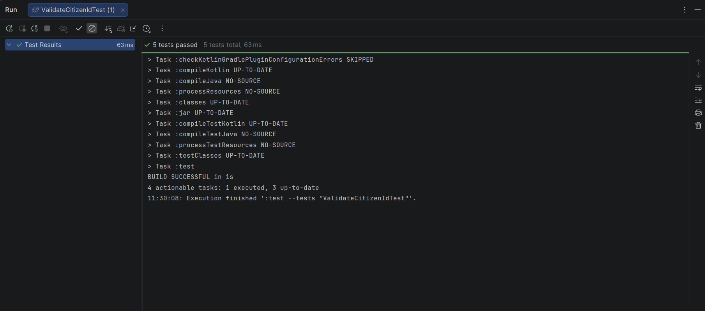

# AI Log - Workshop 3

## Output Console

## รายการที่ 1

| หัวข้อ | คำตอบ                                                                                                                                                           |
| --- |-----------------------------------------------------------------------------------------------------------------------------------------------------------------|
| Prompt ที่ใช้ (สรุป) | ส่ง Unit Test เบื้องต้น 3 เคส (เช็คความยาว, เช็คตัวเลขล้วน) ไปให้ AI แล้วสั่งว่า "เขียนฟังก์ชัน validateCitizenId ให้หน่อย โดยต้องทำให้ Unit Tests เหล่านี้รันผ่านทั้งหมด" |
| AI ตอบผิด / น่าสงสัยตรงไหน | AI เขียนโค้ดมาให้ผ่านแค่ 3 เทสต์แรกจริงๆ (เช็คแค่ `length == 13` กับ `isDigit()`) แต่ยังไม่ได้ตรวจสอบความถูกต้องของเลขบัตรประชาชนตามสูตร Checksum หลักที่ 13 ของไทย |
| เราตัดสินใจ / แก้อย่างไร | นำโค้ดมาเทสต์ให้ผ่านก่อน จากนั้น "เพิ่ม Test เคสที่ 4" (เช็ค Checksum) ที่ทำให้โค้ดเดิมของ AI พัง แล้วส่งกลับไปสั่งให้ AI อัปเดตโค้ดเพื่อให้รันผ่านเทสต์ตัวใหม่ด้วย |
| สิ่งที่ได้เรียนรู้ | ได้เรียนรู้กระบวนการ TDD (Test-Driven Development) ร่วมกับ AI ว่าเราสามารถคุมคุณภาพและกำหนดพฤติกรรมโค้ดของ AI ได้ 100% ผ่านการเขียน Test ดักเอาไว้ล่วงหน้า |

## รายการที่ 2

| หัวข้อ | คำตอบ                                                                                                                                                                                                     |
| --- |-----------------------------------------------------------------------------------------------------------------------------------------------------------------------------------------------------------|
| Prompt ที่ใช้ (สรุป) | เพิ่ม Test เคสที่ 5 สำหรับกรอกเลขไทย (๑-๙) แล้วฟังก์ชันพัง เลยสั่งให้ AI แก้ไขให้รองรับเลขไทย พร้อมกับขอให้ Refactor โค้ดให้ใช้บรรทัดน้อยลง (Idiomatic Kotlin) |
| AI ตอบผิด / น่าสงสัยตรงไหน | โค้ดเดิมฟังก์ชัน `.digitToInt()` พังเมื่อเจอเลขไทย และโค้ดเดิมมีการเขียนวนลูป `for` ตัวแปร `sum` แบบยาวๆ ซึ่งทำงานได้แต่ยังไม่เป็นสไตล์ Kotlin เท่าที่ควร |
| เราตัดสินใจ / แก้อย่างไร | ให้ AI เพิ่ม logic การแปลงอักขระเลขไทยเป็นอารบิกโดยใช้ Character Math (`char - '๐' + '0'.code`) และปรับโค้ดมาใช้ฟังก์ชันขั้นสูงอย่าง `sumOf` แทนการใช้ `for` ลูป |
| สิ่งที่ได้เรียนรู้ | ได้เรียนรู้วิธีการ Normalize ข้อมูลก่อนนำไปคำนวณ และเห็นพลังของ Higher-order functions ใน Kotlin (เช่น `sumOf`, `all`, `map`) ที่ช่วยยุบโค้ดให้สั้น กระชับ แต่อ่านง่าย |